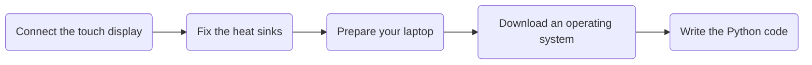

```mermaid
flowchart LR
    A(Connect the touch display) --> B(Fix the heat sinks)
    B --> C(Prepare your laptop)
    C --> D(Download an operating system)
    D --> E(Write the Python code)
	
	click A "https://aninditabasu.github.io/pi-projects/topics/pi_3b_attach_display.html"
	click B "https://aninditabasu.github.io/pi-projects/topics/pi_3b_attach_heatsink.html"
	click C "https://aninditabasu.github.io/pi-projects/topics/set_up_laptop.html"
	click D "https://aninditabasu.github.io/pi-projects/topics/pi_3b_install_os.html"
	click E "https://aninditabasu.github.io/pi-projects/topics/python_photo_frame.html"


```