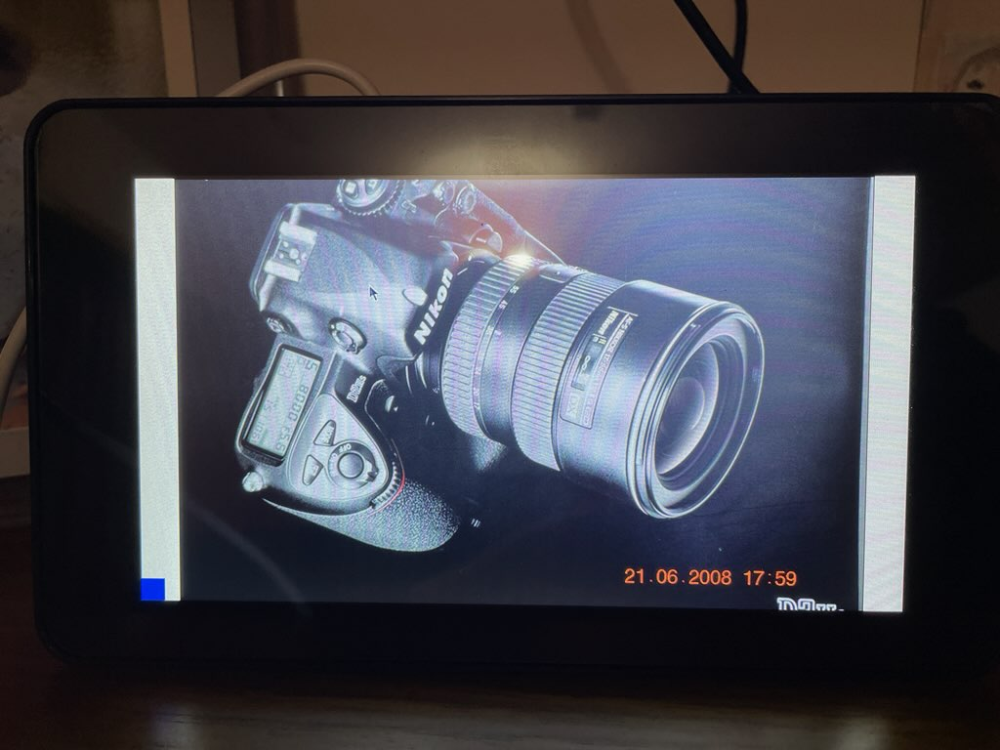

# {{ page.title }}

A digital photo frame is an LED device that can display pictures. It's similar to an LCD TV, inasmuch as you can plug in a USB flash drive to the TV's port and view the pictures. A photo frame is, however, not as large as a typical TV. Quite a few digital frames also have speakers, just like TVs do, so that you can view movie clips on it as well. Unlike a TV, where you must scroll through the pictures manually, a digital photo frame can be configured to display pictures in a continuous loop, advancing to the next picture after a specified time period.

 
To see a larger image, click the image.

In this tutorial, I show you how to use a Raspberry Pi 3B+ computer and a Raspberry Pi Touch Display to make a digital photo frame. Along the way, I explain how to set up a headless Raspberry Pi computer, connect it to a touch display, and then run Python on it. It doesn't matter if you don't know Python, because I'll provide the entire code for you to copy and use. If you do know Python, you can tweak the code to include the enhancements that I'll suggest at the end of the tutorial.

## Materials required

For the photo frame:

-  A Raspberry Pi 3B+ computer. This little computer board will hold the code that displays the photos.
-  A Raspberry Pi 7" official touch display. This screen is where the photos are displayed. You can choose to use any other display screen that can be used with a Raspberry Pi 3B+, but I used the official display because it's a plug-and-play set up.
-  A Raspberry Pi official power adapter. Theoretically, any adapter with a USB-C cable that can plug into the Raspberry should work fine. In practice, it's better to get the official power adapter because it's been tested to deliver the exact power that the Raspberry Pi needs (which is 3A).
-  A microSD card. This tiny card will contain the operating system that your Raspberry Pi will run on.
-  A USB drive. This flash drive will contain your photos.
-  (Optional) Heat sinks. These are little metal blocks that draw the heat away from the processor and the network chip. A photo frame program running on the Raspberry Pi should not heat the computer much, but it is safe practice to use heat sinks.
-  (Optional) An external keyboard and a mouse. These two things are optional, because you can use your laptop keyboard and touchpad to issue commands to the Raspberry Pi.

To set up the Raspberry Pi:

-  A laptop (or desktop), with a microSD port. If your laptop does not have this port, you need a microSD card reader that you can plug into laptop. After the Raspberry Pi is set up and the photo frame is working, you'll no longer need the laptop.
-  Administrator privileges on the laptop, so that you can download all the required software on it.
-  An internet connection. After the set up is complete, you can choose to run the photo frame in an isolated manner, not connected to any network, in which case you won't need the internet connection thereafter.

## Steps

To build the photo frame, you first connect the touch display screen to the Raspberry Pi, then make the Raspberry Pi ready by installing an operating system on it, and finally write a script to display your photo collection.

Here are the step-by-step guides for these tasks:

1.  [Attach the display screen](pi_3b_attach_display.md) to the Raspberry Pi.
1.  (Optional) [Fix the heat sinks](pi_3b_attach_heatsink.md) on the Raspberry Pi.
1.  [Make your laptop ready](set_up_laptop.md) for setting up the Raspberry Pi.
1.  [Install an operating system](pi_3b_install_os.md) on the Raspberry Pi.
1.  [Write the Python code](python_photo_frame.md) for displaying the photos.
1.  (Optional) [Refine the project](photo_frame_refine.md).

