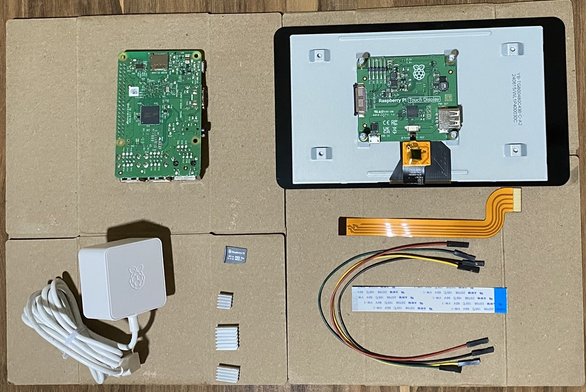

# {{ page.title }}

A digital photo frame is an LED device that can display pictures. It's similar to an LCD TV, inasmuch as you can plug in a USB flash drive to the TV's port and view the pictures. A photo frame is, however, not as large as a typical TV. Quite a few digital frames also have speakers, just like TVs do, so that you can view movie clips on it as well. Unlike a TV, where you must scroll through the pictures manually, a digital photo frame can be configured to display pictures in a continuous loop, advancing to the next picture after a specified time period.

In this tutorial, I show you how to use a Raspberry Pi 3B+ computer and a Raspberry Pi Touch Display to make a digital photo frame. Along the way, I explain how to set up a headless Raspberry Pi computer, connect it to a touch display, and then run Python on it.

## Materials required

For the frame:

-  A Raspberry Pi 3B+ computer. This little computer board will hold the code that displays the images.
-  A Raspberry Pi 7" official touch display. This screen is where the images are displayed. You can choose to use any other display screen that can be used with a Raspberry Pi 3B+, but I used the official display because it's a plug-and-play set up.
-  A Raspberry Pi official power adapter. Theoretically, any adapter with a USB-C cable that can plug into the Raspberry should work fine. In practice, it's better to get the official power adapter because it's been tested to deliver the exact power that the Raspberry Pi needs (which is 3A).
-  A microSD card. This tiny card will contain the operating system that your Raspberry Pi will run on.
-  A USB drive. This flash drive will contain your images.
-  (Optional) Heat sinks. These are little metal blocks that draw the heat away from the processor and the network chip. A photo frame program running on the Raspberry Pi should not heat the computer much, but it is safe practice to use heat sinks.
-  (Optional) A mouse and a keyboard. These two things are optional, because you can use your laptop keyboard and touchpad too to issue commands to the Raspberry Pi.

To set up the Raspberry Pi:

-  A laptop or desktop, with a microSD port. If your machine does not have this port, you need a microSD card reader that you can plug into your machine.
-  An internet connection.

After the Raspberry Pi is set up and the photo frame is working, you'll no longer need the laptop (or desktop). You can also choose to run the photo frame in an isolated manner, in which case you won't need the internet connection either. 

## Set up the Raspberry Pi

This is what I started with.

| Front view | Back view |
| ---------- | --------- |
|  | |

To get this little computer up and running, you must:

-  Attach the display screen to the Raspberry Pi.
-  Install an operating system in the Raspberry Pi.
-  (Optional) If you don't have an external keyboard and mouse, set up Pi Connect so that you can control the Raspberry Pi from your laptop or desktop.

### Attach the display screen

The Raspberry Pi is what they call an SBC (a single board computer). It has neither a screen where you can see the output of your commands, nor a keyboard through which you can issue commands. It is just a barebones computer, with no peripheral devices such as keyboard, mouse, monitor, speaker, or microphone. To use a Raspberry Pi as a computer, you must manually attach these peripherals to it. In this tutorial, you're building a photo frame, so the barest minimum peripheral device that you need is a screen.

To mount the display screen on to the computer board, you loosen the four screws at the four ends of the board at the back of the frame, place the Raspberry Pi on to it, and put the screws back in place. You then connect these two objects by means of two wires (red and black) and a cable (the white straight strip). You don't need the shiny curved strip also shown in the picture; it came as standard packaging with the display and is used in Raspberry Pi 4 models. The model being used here is Raspberry Pi 3B+, though, so the straight white strip is the one to use.

How to attach the display screen to the computer board is explained well in this YouTube video: 

<iframe width="560" height="315" src="https://www.youtube.com/embed/SyhJctufiRI?si=Hv3bjPuczohvv8ES" title="YouTube video player" frameborder="0" allow="accelerometer; autoplay; clipboard-write; encrypted-media; gyroscope; picture-in-picture; web-share" referrerpolicy="strict-origin-when-cross-origin" allowfullscreen></iframe>

If you'd rather read some written instructions rather than watch a video, see this official guide from the good folks at Raspberry Org: [Touch Display](https://www.raspberrypi.com/documentation/accessories/display.html).

#### (Optional) Attach the heat sinks

After the display screen is mounted on the computer board, affix the heat sinks to the board. The three small corrugared squares that you see in the bottom quadrant of the images are the ehat sinks. A Raspberry Pi Model 3B+ needs only two of those. To attach them to the CPU chip and the network chip, you peel off the adhesive strip at the back of the heat sink, and press it ever so slightly on to the chips on the Pi board. How to do so is shown in this YouTube video:

<iframe width="560" height="315" src="https://www.youtube.com/embed/Xg5n56x9Y7A?si=tw5MF9EhXMR4aG-e" title="YouTube video player" frameborder="0" allow="accelerometer; autoplay; clipboard-write; encrypted-media; gyroscope; picture-in-picture; web-share" referrerpolicy="strict-origin-when-cross-origin" allowfullscreen></iframe>

### Install an operating system

Do you see the microSD card near the center of the image? The operating system will be downloaded on to that card, and then inserted into the microSD slot of the Raspberry Pi.

The steps to download the operating system are:

1.  

## Write and test the code

```Python
print("Frames and Shells")
```

## Refine


