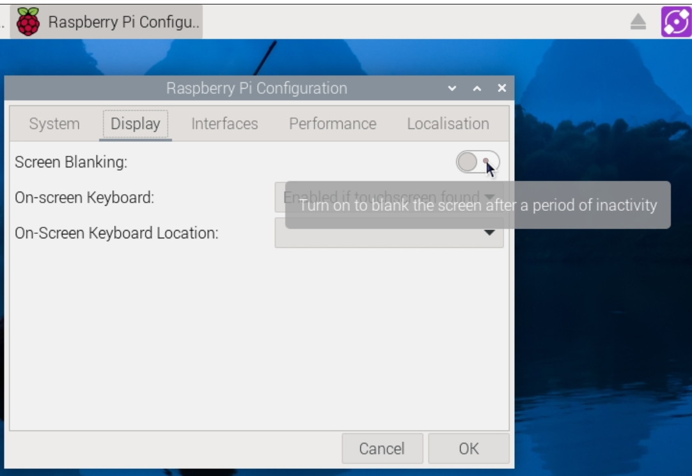



# {{ page.title }}

Now that your digital photo frame is working, consider incorporating the following enhancements to your project.

-  [Never go to sleep](#never-go-to-sleep)
-  [Touch to stop](#touch-to-stop)
-  [Pull from the cloud](#pull-from-the-cloud)
-  [Make a stand](#make-a-stand)

## Never go to sleep

Disable the screen blanking function of the Raspberry Pi. The screen can turn completely black after a period of inactivity. This means, if you start the Python program and then leave it on to loop through your pictures continuously, what might happen is that the screen will eventually turn blank. The Raspberry Pi is still on (and it hasn't gone to sleep), and the Python program is still running, but the screen is black because of inactivity.

For this project, you installed {{page.baseos}} on {{page.pimodel}}. By default, screen blanking is turned off in {{page.baseos}}, so you shouldn't need to do anything further, but just for peace of mind, ensure that it's really turned off. Click the Raspberry Pi icon near the top of the screen, and then click **Preferences > Raspberry Pi Configuration > Display**. The screen blanking option should be turned off, similar to what's shown in the following image:

<a href = "../images/debian_bookworm_screen_blanking.png"></a><br/>
<span style="font-size:75%;">To see a larger image, click the image.</span>

## Touch to stop

Add a touch button to stop the Python script. The script you're using now can be stopped by pressing the `Esc` key on a keyboard, but you might not always have the USB receiver for the keyboard plugged into the Raspberry Pi. Stopping the script might become necessary in the following situations:

-  To power down the Raspberry Pi.
-  To load more photos on to the flash drive, in which case you must eject the drive, load the files into it, and then insert it back into the Raspberry Pi.

Here's the [code with stop-on-touch function](https://raw.githubusercontent.com/AninditaBasu/pi-projects/refs/heads/main/_includes/pyscript_photo_frame_touch_stop.py). 

Notice the lines 44 through 50. These lines contain the code to stop the program with a touch or by clicking the left mouse-button. You add a small blue square near the bottom left corner, and you bind this square to the Stop action.

```python
# Add a blue button for touchscreen stop functionality
def stop_program(event):
    root.destroy()
# Create an overlay in the top-left corner (25x25 pixels) to detect touch
touch_exit_area = tk.Frame(root, width=25, height=25, bg="blue")  # Blue for visibility purposes
touch_exit_area.place(x=0, y=0)
touch_exit_area.bind("<Button-1>", stop_program)  # Bind left mouse button or touchscreen press
``` 

## Pull from the cloud

Have the Python display loop also include photos from a cloud drive.

## Make a stand

Put the entire assembly into a case or stand. Doing so not only protects the computer boards from dust, but also gives support to the assembly so that it can stand on its own, without you having to use books or other such objects as props. I used a [Multicomp Pro case :arrow_upper_right:](https://www.amazon.in/Robotism-Official-Screen-Display-Raspberry/dp/B09KTRT3KF), which was the only case available in my part of the world. Other options are a [Pimoroni stand :arrow_upper_right:](https://shop.pimoroni.com/products/raspberry-pi-7-touchscreen-display-frame?variant=6337432065) or a 3-D printed case from the [designs at thingiverse.com :arrow_upper_right:](https://www.thingiverse.com/search?q=raspberry+touchscreen+display&page=1).
