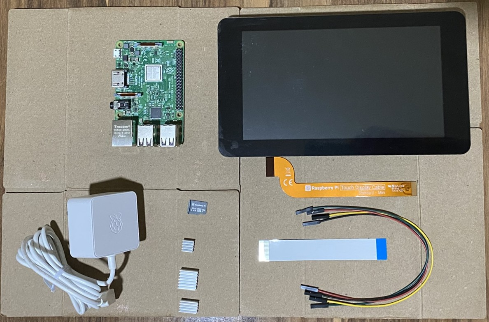
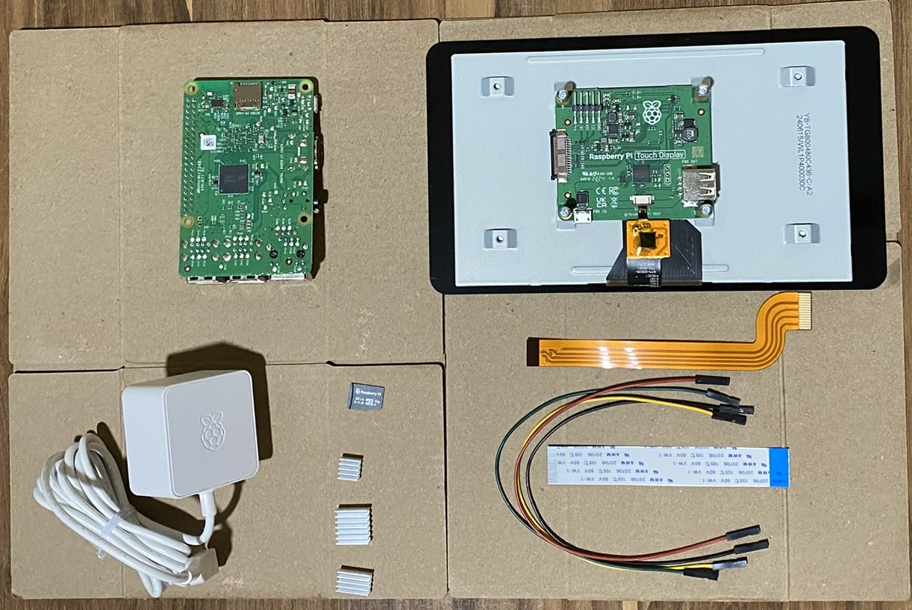
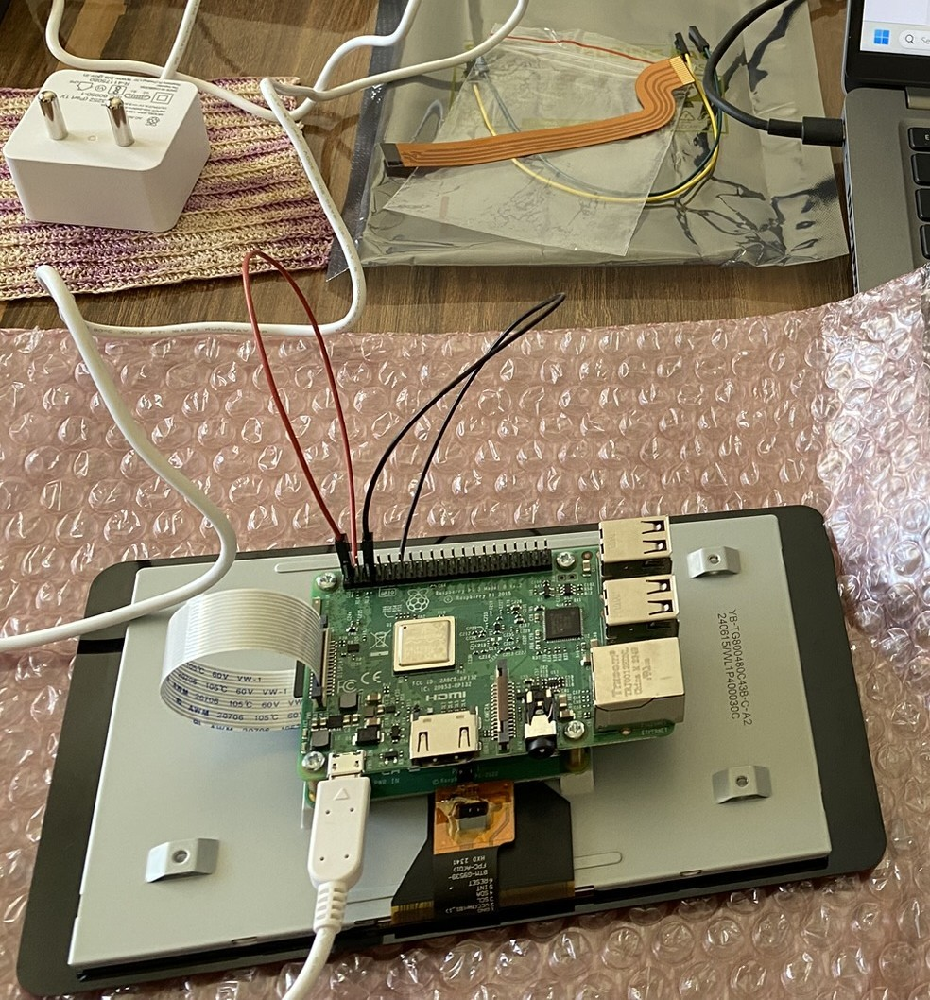

# {{ page.title }}

The Raspberry Pi is what they call an SBC (a single board computer). It has neither a screen where you can see the output of your commands, nor a keyboard through which you can send these commands to the computer. It is just a barebones computer, with no peripheral devices such as keyboard, mouse, monitor, speaker, or microphone. To use a Raspberry Pi as a computer, you must manually attach these peripherals to it. 

In this tutorial, though you're not going to use the Raspberry Pi as a computer, you *are* building a photo frame. Therefore, the barest minimum peripheral device that you need is a display screen.

For building my photo frame, these are the materials I used. Your materials look the same, I believe.

| Front view | Back view |
| ---------- | --------- |
|  | |

Notice the left side of the images. At the top left quadrant is the Raspberry Pi board. At the bottom left is the power supply, the heat sinks, and the microSD card. These objects, when put together, constitute a standalone Raspberry Pi computer that you can use to do...stuff. Like building a digital photo frame.

Look at the right half of the images. The objects there are what's included in a standard pack of the Raspberry Pi Touch Display. When plugged into a Pi computer (which you can assemble from the materials at the left), this set becomes the display unit for the Pi computer. 

Notice the view of the display screen from the back (second image, upper right quadrant).  The green board, called the controller board, has four little screws at the four corners. To mount the display screen on to the Raspberry Pi, you loosen these four screws at the four ends of the controller board of the display screen, place the Raspberry Pi on to it, and put the screws back in place.

You then connect these two objects by means of two wires (red and black) and a cable (the white straight strip). Two things to note here:

-  You don't need the shiny curved strip also shown in the picture; it came as standard packaging with the display and is used in Raspberry Pi 4 models. The model being used here is Raspberry Pi 3B+, though, so the straight white strip is the one to use. In the Pi world, these strips are known as ribbon cables.
-  You also don't need the yellow wire and the green wire. In the Pi world, this kind of wire is called a jumper cable. Your photo frame uses a Raspberry Pi 3B+, which needs only two wires. The yellow and green wires are needed only if you're using an older model of the Raspberry Pi, one that does not have a 40-pin GPIO strip. For this tutorial, the GPIO pins aren't needed so they won't be discussed, but if you're curious, you can read up on `GPIO`, `SCL`, and `SDA` pins.

When you're done, the entire assembly should look somethings like this:

Detailed steps on how to attach the display screen to the Raspberry Pi is shown in this YouTube video: 
<iframe width="560" height="315" src="https://www.youtube.com/embed/SyhJctufiRI?si=Hv3bjPuczohvv8ES" title="YouTube video player" frameborder="0" allow="accelerometer; autoplay; clipboard-write; encrypted-media; gyroscope; picture-in-picture; web-share" referrerpolicy="strict-origin-when-cross-origin" allowfullscreen></iframe>

If you'd rather read some written instructions than watch a video, see this official guide from the good folks at Raspberry Org: [Touch Display](https://www.raspberrypi.com/documentation/accessories/display.html).

After the display screen is mounted on the computer board, [affix the heat sinks to the board](pi_3b_attach_heatsink.md).
