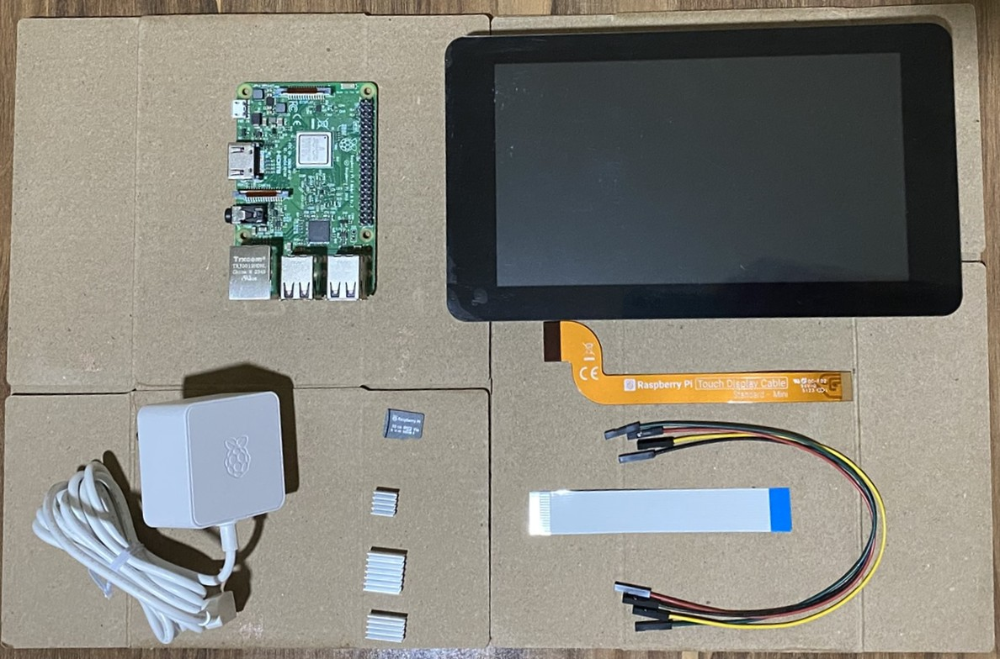

# {{ page.title }}

The three small corrugared squares that you see in the bottom quadrant of the image are the heat sinks. A Raspberry Pi Model 3B+ needs only two of those. They draw the heat away from the processor and the network chip. A photo frame program running on a Raspberry Pi 3B+ should not heat the little computer too much, but it is safe practice to use heat sinks.

To attach them to the CPU chip and the network chip of the little computer board, you peel off the adhesive strip at the back of the heat sink, and press it ever so slightly on to the chips on the Pi board. How to do so is shown in this YouTube video:

<iframe width="560" height="315" src="https://www.youtube.com/embed/Xg5n56x9Y7A?si=tw5MF9EhXMR4aG-e" title="YouTube video player" frameborder="0" allow="accelerometer; autoplay; clipboard-write; encrypted-media; gyroscope; picture-in-picture; web-share" referrerpolicy="strict-origin-when-cross-origin" allowfullscreen></iframe>

After the heat sinks are in place, install an operating system on your Raspberry Pi.