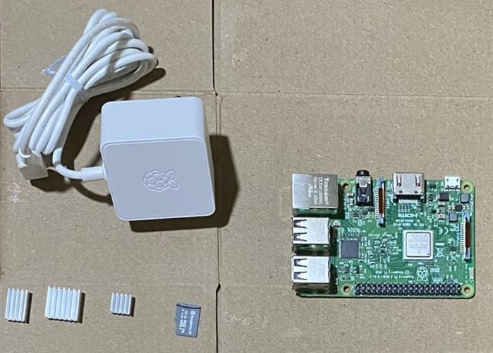

# {{ page.title }}

Do you see the black microSD card near the bottom center of the image, right next to the three heat sinks? 

The operating system will be downloaded on to that card, which will then be inserted into the microSD slot of the Raspberry Pi. That's what will get this little computer up and running, and make it available for you for the final steps of the photo frame project.

## Steps


1.  Insert the microSD card to the Pi's board, plug in the power adapter to a wall socket, and insert the cable into the USB-C power slot of the Raspberry Pi. If you're going to use an external keyboard and mouse, insert the USB receivers for these devices into the USB ports of the Pi.
1. Turn on the power switch of the wall socket. The light on the Raspberry Pi board should glow green, and the display screen should first show a rectangle of rainbow colours, and then finally show you the Raspberry Pi desktop screen.
1.  If you already have an external keyboard and mouse, proceed to the next step. If you don't, (or if you want to do this step anyway because there's no harm if you do), [set up Raspberry Pi Connect](pi_piconnect.md). If you install Raspberry Pi Connect, you can log in to the Pi from any other computer, and use that computer's keyboard and mouse to control the Pi. To set up Raspberry Pi Connect, see the official documentation: [Raspberry Pi Connect (Beta)](https://www.raspberrypi.com/documentation/services/connect.html).
1.  Shut down the Raspberry Pi by clicking the Raspberry Pi icon near the top left and then clicking **Shutdown > Shutdown**. Then, switch off the power supply to the Pi.

Now that your Pi is ready to be used as a computer, you can proceed to [creating the Python script](python_photo_frame.md) that displays your photo collection.

## Troubleshooting

