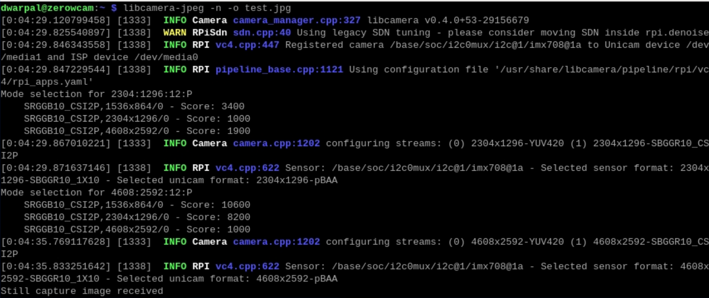
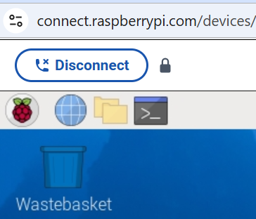



# {{ page.title }}

The 12-megapixel Camera Module 3 is the latest official camera module. 

 
To see a larger image, click the image.

When you buy the camera module, you get two connector cables:
-  A white one, which is a 40-pin-to-40-pin cable and made for the Raspberry Pi 3 and Raspberry Pi 4 models.
-  A golden one, which is a 40-pin-to-22-pin cable and made for the Raspberry Pi 5 and Raspberry Pi Zero models.

In the image, you also see a shorter golden cable. I bought this separately; it's also a 40-pin-to-22-pin cable but shorter.

For this project, you must attach the camera module to the {{page.pimodel}} with the golden cable.
 
1.  Turn the camera module upside down, with the lens facing down. You see a metal clip. Loosen the clip by pulling down the two tiny clamps at the ends.
1.  Insert the broad end of the golden cable into this clip, taking care that the metal connectors are facing down (that is, towards the lens side). 
1.  Push the clamps down, so that the clip sits firmly back in its place.
1.  On the {{page.pimodel}}, pull out the camera clip. It's located near the power port.
1.  Insert the narrower end of the cable, with the metal connectors facing the bottom side of the Raspberry Pi. Push the clamps down firmly. I took the help of [this YouTube video](https://www.youtube.com/watch?v=uWOlf4aECC8) that shows which clips to pull, push, and connect to.
1.  Verify that the camera is working as expected:
    1.  Switch on the Raspberry Pi.
	1.  Open a terminal window and run the following command: `libcamera-jpeg -n -o test.jpg`. You should see several messages being written to the terminal, ending with a message saying that a picture was taken. This means that the camera module was detected and is working fine.
	
1.  If you don't see a success message on the terminal, verify that the camera pins are firmly in place. Then, try to use the terminal messages to troubleshoot. An AI agent such as ChatGPT can help.
1.  If you're not immediately proceeding to the next step, shut down the Raspberry Pi by typing the following command on the terminal: `sudo shutdown -h now`. You should be disconnected from Raspberry Pi and the terminal window should disappear.  Wait till the green light on the Raspberry Pi board stops flashing, and then switch off the power supply.

Now that the camera is in place, [write the bash code](bash_security_camera.md) for the surveillance setup.

Because you're logged in through the terminal, you wouldn't be able to "see" the picture that you captured and saved as `test.jpg`. To see the image file, use the graphical interface of the Raspberry Pi computer itself and open the picture through its file manager. Here are the steps:

1.  Switch on Raspberry Pi.
1.  On your laptop, open `https://connect.raspberrypi.com/` and sign in.
1.  On the Devices page, you should see your Raspberry Pi. If you don't, wait for a few minutes and refresh the page.  Then, click **Connect via > Screen sharing**, and wait for a few seconds for the remote session to start. You should now see the Raspberry Pi desktop in your laptop browser.
1.  Open **File Manager**. It's one of the icons near the top where you see the Raspberry Pi icon.

1.  In File Manager, go to `home/<your user name>`. You should see a file called `test.jpg`. To view the file, double-click it.
1.  When done, and if you're not immediately proceeding to the next step, shut down the Raspberry Pi by typing the following command on the terminal: `sudo shutdown -h now`. You should be disconnected from Raspberry Pi and the terminal window should disappear.  Wait till the green light on the Raspberry Pi board stops flashing, and then switch off the power supply.
