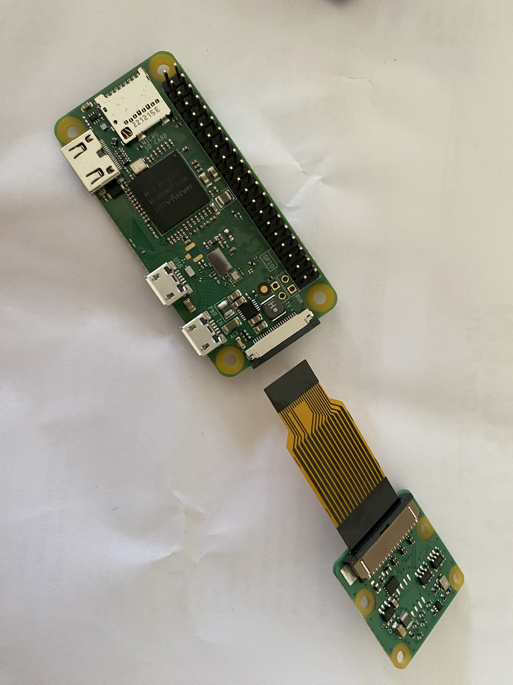



# {{ page.title }}

The 12-megapixel Camera Module 3 is the latest official camera module. 

 
To see a larger image, click the image.

When you buy the camera module, you get two connector cables:
-  A white one, which is a 40-pin-to-40-pin cable and made for the Raspberry Pi 3 and Raspberry Pi 4 models
-  A golden pne, which is a 40-pin-to-22-pin cable and made for the Raspberry Pi 5 and Raspberry Pi Zero models.

In the image, you also see a shorter golden cable. I bought this separately; it's also a 40-pin-to-22-pin but shorter.

For this project, you must attach the camera module to the Raspberry Pi Zero with the golden cable.
 
1.  Turn the camera module upside down, with the lens facing down. You see a metal clip. Loosen the clip by pulling down the two tiny clamps at the ends.
1.  Insert the broad end of the golden cable into this clip, taking care that the metal connectors are facing down (tha is, towards the lens side). 
1.  Push the clamps down, so that the clip sits firmly back in its place.
1.  On the Raspberry Pi Zero, pull out the camera clip. It's located near the power port.
1.  Insert the narrower end of the cable, with the metal connectors facing the bottom side of the Raspberry Pi. Push the clamps down firmly.
1.  Verify that the camera is working as expected:
    1.  Switch on the Raspberry Pi Zero.
	1.  Open a terminal window and run the following command: `libcamera-jpeg -o test.jpg`.
1.  Open **File Manager** (it's one of the icons near the top). You should see a file called `test.jpg`. This means that the camera module was detected and is working fine.

Here's an YouTube video that shows you the steps in detail:

<iframe width="560" height="315" src="https://www.youtube.com/embed/uWOlf4aECC8?si=7iUEbVOxTs8Z9F7I" title="YouTube video player" frameborder="0" allow="accelerometer; autoplay; clipboard-write; encrypted-media; gyroscope; picture-in-picture; web-share" referrerpolicy="strict-origin-when-cross-origin" allowfullscreen></iframe>

After the camera is in place, [write the bash code for the surveillance setup](bash_security_camera.md).
