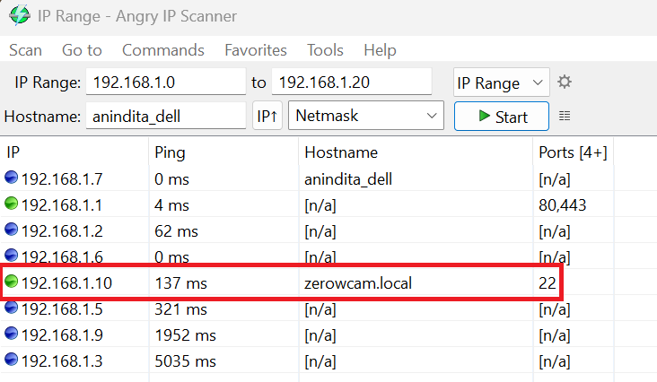



# {{ page.title }}

The following image shows the three (of the four) things that you need for the project: a power supply, a {{page.pimodel}} board, and a microSD card.  

 
To see a larger image, click the image.

An operating system will be downloaded on to this microSD card, which will then be inserted into the microSD slot of the Raspberry Pi, which will then be plugged into a power socket. That's what will get this little computer up and running, and make it ready for the project.

## Steps


1.  On the Raspberry Pi, locate the microSD card slot (it's midway between the mini-HDMI port and the header pins) and insert the microSD card into the slot.
1.  Plug in the Raspberry Pi power adapter to a wall socket, and insert the cable into the USB-C power slot of the Raspberry Pi. Turn on the power switch of the wall socket. The light on the Raspberry Pi board should glow green.
1.  Log in to the Raspberry Pi from your laptop:
    1.  Find the IP address of your nework gateway. To do so, on your laptop, open the command prompt, and type `ipconfig`. Then, note down the value that's displayed as **Default Gateway**.
    1.  Start Angry IP Scanner. For the first box in the **IP Range** field, specify the value of the default gateway that you noted down in the previous step. For the second field, specify a number that's about 15-20 stops away. For example, if your default gateway is `192.168.4.1`, specify the end range to be something around `192.168.4.15`, so that the scan doesn't take too long. (The assumption here is that you don't already have more than 15 devices connected to your network!) Click **Start** and wait for the scan to be over. Then, in the **Hostname** column, look for the name of your Raspberry Pi. This is the name that you specified as the hostname in the OS Customisation settings while downloading the operating system on the microSD card. When you've spotted this hostname, look for the entry in the **IP** column. You need this value in the next step. 
	1.  Start PuTTY and enter the IP address of the Raspberry Pi. This is the value that you noted down in the previous step. Click **Open**. When prompted for login credentials, enter the user name and password that you specified in the OS Customisation settings while downloading the operating system on the microSD card. You should now see a prompt like this: `<hostname>@<username>:~ $`. For example, if your hostname is `delphi` and user name is `oracle`, you'll see `delphi@oracle:~ $`. It means you're now logged in to your Raspberry Pi and everything's working as expected.
1.  Update the operating system that you installed on the microSD card. You used Raspberry Pi Imager for downloading the operating system but it might not contain the latest patches, fixes, and upgrades. Pull these things in.
    1.  To see if there are any updates to the operating system, run the following command: `sudo apt-get update`. The local cache of the Raspberry Pi is updated with the package information for the package repositories. You're shown a list of the these packages, and now it's up to you to upgrade them to their latest versions.
    1.  Upgrade the software shown on the list by running the following command: `sudo apt-get upgrade`. When prompted for permission to proceed with the upgrade, answer in the affirmative. The actual updates for the installed software and the operating system are now downloaded and installed on your Raspberry Pi.	
 
1.  Shut down the Raspberry Pi by typing the following command on the terminal: `sudo shutdown -h now`. You should be disconnected from Raspberry Pi and the terminal window should disappear.  Wait till the green light on the Raspberry Pi board stops flashing, and then switch off the power supply.

Now that your Raspberry Pi is ready to be used as a computer, you can proceed to [attaching the camera module to it](pi_zero_attach_camera3.md).

