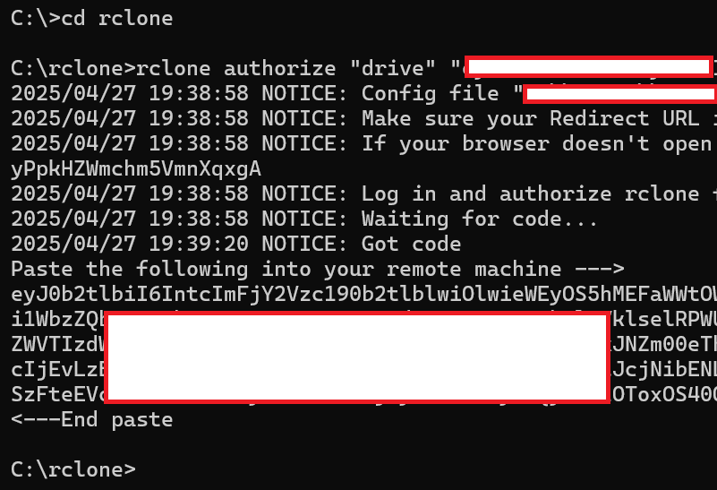



# {{ page.title }}

Now that your surveillance camera is working, consider the following enhancements.

-  [Never lose a frame](#never-lose-a-frame)
-  [Keep cool](#keep-cool)
-  [Stop elegantly](#stop-elegantly)
-  [Back up](#back-up)

## Never lose a frame

You might have noticed that the videos have timestamps like this:

```
ve_20250420_122534.h264
ve_20250420_122644.h264
ve_20250420_122753.h264
ve_20250420_122903.h264
```

You're losing about 9 to 10 seconds between each video.

```
ve_20250420_122534  → 12:25:34
ve_20250420_122644  → 12:26:44  → +1 min 10 sec
ve_20250420_122753  → 12:27:53  → +1 min 9 sec
ve_20250420_122903  → 12:29:03  → +1 min 10 sec
``` 

Even though you're capturing 1-minute videos, the next one doesn't start immediately at the end of the previous one. Rather, there's a small delay while one `libcamera-vid` command finishes and the next one starts. But a lot can happen in 10 seconds! To not lose any frames, use a background recording, by tweaking the bash script a bit.

```
#!/bin/bash
SAVE_PATH="/home/oracle/Videos"
mkdir -p "$SAVE_PATH"

while true; do
  TIMESTAMP=$(date +%Y%m%d_%H%M%S)
  libcamera-vid --nopreview --width 640 --height 480 --bitrate 1000000 --timeout 60000 -o "$SAVE_PATH/ve_$TIMESTAMP.h264" &
  wait
done
``` 

Notice the following difference:

```
  libcamera-vid --nopreview --width 640 --height 480 --bitrate 1000000 --timeout 60000 -o "$SAVE_PATH/ve_$TIMESTAMP.h264" &
  wait
```

Here:

-  `----timeout 60000`: This sets how long the video recording lasts in milliseconds. 60000 ms means 60 seconds (1 minute). You can change this to however long you want each video segment to be.
-  `&`: This little symbol at the end means the command should be run in the background, so that the script doesn't pause while the video is recording; rather, it moves on and prepares for the next loop.
-  `wait`: This pauses the script for the timeout duration until tha background command finishes. When the video recording ends, the script continues.

This change slightly reduces how long it takes for the next loop to begin. It is by no means seamless, but it at least reduces the 10s delay to about 2s to 3s.

## Keep cool

Security cameras, like Lakshman, don't sleep. This means that the Raspberry Pi computer will be running continuously, days on end. If you live in an area like mine, where summer temperatures can cross 50 degrees centigrade, you'd like to ensure that the camera hanging outside doesn't get too hot (Lakshman was known to be extremely hot-tempered, though). Consider using an [aluminium heat sink](https://www.waveshare.com/zero-heatsink.htm) made specially for Raspberry Pi Zero W.

## Stop elegantly

To stop the bash command that you started with `./simplevideo.sh`, you press Ctrl + C in the terminal window. Oftentimes, you might see that the script automatically start recording again. This happens because of the following line in your script:

```
libcamera-vid ... &
wait
```

`&` puts `libcamera-vid` in the background. `wait` then pauses until *that* background process finishes. `while true` restarts the loop. Endlessly. When you press Ctrl + C, your action sends an interrupt signal (called `SIGINT` in the Debian world) to the foreground process (the `wait` command). But because `libcamera-vid` is running in the background, it may not receive that signal and, therefore, the loop continues and restarts the background recording.

To handle this situation gracefully, set a trap to catch the interrupt signal in the bash script. The modified script should look like this:

```
#!/bin/bash
SAVE_PATH="/home/dwarpal/Videos"
mkdir -p "$SAVE_PATH"

# Trap Ctrl+C (SIGINT)
trap "echo 'Stopping...'; kill 0; exit" SIGINT

while true; do
  TIMESTAMP=$(date +%Y%m%d_%H%M%S)
  libcamera-vid --nopreview --width 640 --height 480 --bitrate 1000000 --timeout 60000 -o "$SAVE_PATH/ve_$TIMESTAMP.h264" &
  wait
done
```

Notice the new bit, which is on lines 4 and 5. `trap ... SIGINT` listens for Ctrl + C. `kill 0` sends a signal to all processes in the current script group so that it kills the background `libcamera-vid` and stops the loop. `exit` stops the script elegantly. `echo` prints a message on the terminal.

## Back up

Because this project is about surveillance, you wouldn't want to lose files before you've seen them. The Raspberry Pi Zero is a marvellous computer, but its limited resources means that you can't really connect a screen to it and keep viewing the video files without drawing upon too much of its resources. An alternative is to move the files to another computer and view them at leisure.

-  Manually transfer the videos to a different computer
-  Automatically upload the videos to a cloud storage

### Manual transfer to another computer


### Automatic upload to a cloud storage

Use the `rclone` package to point to your cloud storage, and then create a cronjob that automatically moves the files from Raspberry Pi to cloud storage at the specified time. This task has several steps.



1.  Switch on your laptop and install `rclone` on it:
    1.  Go to the [rclone downloads page](https://rclone.org/downloads/) and download the `.zip` file for your Windows laptop.
	1.  Extract the content to any folder, for example, `C:/rclone`. Make a note of this folder because you'll need it in a subsequent step.
1.  Switch on your Raspberry Pi, log into it by using Connect on your laptop, and then open a terminal window on Raspberry and install `rclone` by running the following command commands one after the other:
    1.  `sudo apt update`: To find all patches and fixes since the last time that the Raspberry Pi was updated
	1.  `sudo apt upgrade -y`: To download and install the packs identified in the previous step.
	1.  `sudo apt install rclone -y`: To install `rclone`.
1.  Connect `rclone` to your cloud store:
    1.  Start the configuration process by running the following command: `rclone config`.
	1.  At the first prompt, type `n` (for `New remote`). 
	1.  Specify a name for the connection, for example, `gdrive`. Make a note of this name because you'll need it soon in a subsequent step.
	1.  Scroll through the long list that you're presented with and identify the number for the cloud storage service. Then, type the number.
	1.  Leave the fields for `Client ID` and `Secret` blank by entering nothing and pressing Enter.
	1.  For the scope of access, enter `1` for full access.
	1.  Leave the fields for `Root Folder ID` and `Service Account File` blank by entering nothing and pressing Enter.
	1.  Say `No` to advanced config. Say `No` to auto-config as well. You'll be given a command for authorising `rclone`, for example, `rclone authorize "drive" "abCdE12wfGH3IjKlmNOpQr4"`. Copy that command.
	1.  Return to your laptop, open the command prompt, and go to the folder where you extracted `rclone` to. Paste the command that you copied from Raspberry Pi. You're given a verification code. 
	    
    1.  Copy the verification code, return to the Raspberry Pi terminal, and paste it. You see a confirmation message. If asked whether to configure the setup as a shared drive, respond in the negative. Enter `y`, and then exit the configuration setup by entering `q`.
1.  Test the connection by running the following commands one after the other. You should see a folder called `rclonetest` in your cloud storage with a file called `testfile.txt` that has a single line saying `Testing rclone setup`. Before running the commands, replace `gdrive` with the name of your cloud storage. You made a note of this name in a previous step.
    -  `echo "Testing rclone setup" > testfile.txt`
	-  `rclone copy testfile.txt gdrive:rclonetest`
1.  ... still writing ...


	
 
 