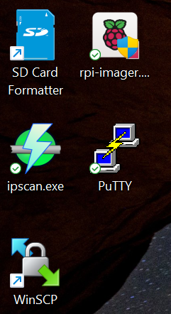

# {{ page.title }}

Before you can use your laptop to run a Raspberry Pi OS installation, make sure that the following software is available on it.

-  
-  
-  
-  
-  (Optional) 

When you're done, you should have the following software on your laptop. 

You are now ready to install an operating system on your [Raspberry Pi Zero W](pi_zero_install_os.md),  [Raspberry Pi 3B+](pi_3b_install_os.md), or [Raspberry Pi 4](pi_4_install_os.md).
